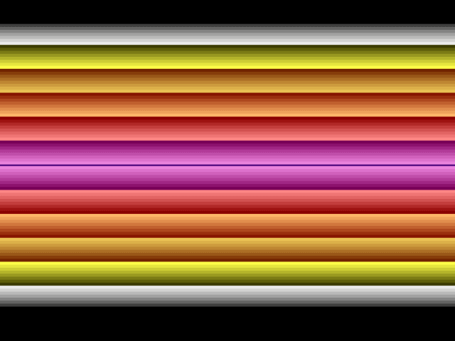

# CSharpTo2600

###### Iteration 3
---
A compiler and framework for creating Atari 2600 games using C#. It uses the .NET Compiler Platform (Roslyn) to compile C# files, and Mono.Cecil to compile the resulting CIL into 6502 assembler macros.

### Current Status
The first iteration of this project compiled C# directly to 6502 assembly.\
The second iteration of this project compiled CIL directly to 6502 assembly.\
The third (and current) iteration of this project instead compiles CIL to custom macros for the 6502 assembler. This offers a higher level of abstraction to compile to, and makes it easier to optimize the results. We're also now using [6502.Net](https://github.com/informedcitizenry/6502.Net) as the assembler instead of DASM, so every part of the compiler is running on .NET.

### Current Goal
The ultimate goal is to add all the features needed for me to port my [attempt at a 2600 game](https://gist.github.com/Yttrmin/18ecc3d2d68b407b4be1) to C#. Along the way, I'd like to support as many useful C# features as possible.

Performance won't be as good as programs written in 6502 assembly. But my hope is that the convenience of being able to use C# will be a worthwhile tradeoff for simpler games.

Progress will likely be slow since I have other personal projects I'm also working on.

### Example

The samples that currently exist are largely just for developing and testing specific features. The compiler's feature set is not stable yet, so any major samples would likely become obsolete.
Below is an example of how you could, at the time of writing, write a [program using the `StandardTemplate` to draw ascending then descending color values](./Samples/StandardTemplateSample.cs).

```csharp
using VCSFramework;
using VCSFramework.Templates.Standard;
using static VCSFramework.Registers;

namespace Samples
{
    [TemplatedProgram(typeof(StandardTemplate))]
    public static class StandardTemplateSample
    {
        private static byte BackgroundColor;

        [VBlank]
        public static void ResetBackgroundColor() => BackgroundColor = 0;

        [Kernel(KernelType.EveryScanline)]
        [KernelScanlineRange(192, 96)]
        public static void KernelAscend()
        {
            ColuBk = BackgroundColor;
            BackgroundColor++;
        }

        [Kernel(KernelType.EveryScanline)]
        [KernelScanlineRange(96, 0)]
        public static void KernelDescend()
        {
            ColuBk = BackgroundColor;
            BackgroundColor--;
        }
    }
}
```

This produces the following output:


### Features
An incomplete list of supported features in no particular order. Instructions may have various limitations, which I'll try to note.

* :o: Primitive Types
  * :heavy_check_mark: `bool`
  * :heavy_check_mark: `byte`
  * :x: `sbyte`
  * :x: `ushort`
  * :x: `short`
* :x: Array types
* :heavy_check_mark: Pointer Types
* :o: Custom Types
  * :heavy_check_mark: Value Types
    * :heavy_check_mark: Single-byte types
	  * :o: Multi-byte types (Not supported by all instructions yet)
	  * :heavy_check_mark: Composite types (struct-in-struct)
    * :heavy_check_mark: Generic type
  * :o: Reference Types
    * :heavy_check_mark: Static types
    * :x: Instance types (Probably never)
* :o: Static Members
  * :heavy_check_mark: Fields
  * :x: Properties
  * :o: Methods (Pending function rework)
    * :x: 0-parameter
    * :x: >0-parameter
    * :x: `void` return
    * :x: Non-`void` return
* :o: Ease of Development
  * :o: Inline Assembly
    * :heavy_check_mark: Static field aliasing
  * :o: ROM Data Access
    * :o: `RomData<>` struct
      * :heavy_check_mark: Constant indexing of types >8-bit in size
      * :x: Non-constant indexing of types >8-bit in size
      * :x: `foreach` support
  * :o: Program Templates
    * :heavy_check_mark: `RawTemplate`
    * :o: `StandardTemplate`
      * :heavy_check_mark: VBlank callback
      * :heavy_check_mark: Overscan callback
      * :o: Kernel callback
        * :heavy_check_mark: `Manual`
        * :heavy_check_mark: `EveryScanline`
        * :o: `EveryEvenNumberScanline` / `EveryOddNumberScanline`
      * :heavy_check_mark: Kernel scanline range
      * :x: Screen switching support
* :o: CIL OpCodes
  * :o: Arithmetic
    * :o: Addition (`add`, 8-bit only)
	  * :o: Subtraction (`sub`, 8-bit only)
	  * :x: Division
	  * :x: Multiplication
  * :o: Bitwise
    * :o: Or (`or`) (Operands must be same type and 8-bit)
  * :o: Branching
    * :heavy_check_mark: Branch if true (`brtrue`, `brtrue.s`)
	  * :heavy_check_mark: Branch if false (`brfalse`, `brfalse.s`)
	  * :heavy_check_mark: Unconditional branch (`br`, `br.s`)
    * :heavy_check_mark: Branch if less than (`blt`, `blt.s`)
  * :o: Comparison
    * :o: Equal (`ceq`) (8-bit only)
    * :x: Greater than (`cgt.un`)
  * :o: Load
    * :x: Argument (`ldarg`, `ldarg.s`, `ldarg.0`, `ldarg.1`, `ldarg.2`, `ldarg.3`)
	  * :heavy_check_mark: Constant (`ldc.i4`, `ldc.i4.s`, `ldc.i4.0`, `ldc.i4.1`,`ldc.i4.2`,`ldc.i4.3`,`ldc.i4.4`,`ldc.i4.5`,`ldc.i4.6`,`ldc.i4.7`,`ldc.i4.8`) (up to 16-bit)
	  * :x: Element
	  * :heavy_check_mark: Field (static) (`ldsfld`)
	    * :heavy_check_mark: Address (`ldsflda`)
	  * :o: Field (instance) (`ldfld`) (8-bit only)
	    * :o: Address (`ldflda`) (Zero-page pointers only)
    * :o: Indirect (`ldind.u1`)
    * :o: Local (`ldloc`, `ldloc.s`, `ldloc.0`, `ldloc.1`, `ldloc.2`, `ldloc.3`) (Pending function rework)
      * :o: Address (`ldloca`) (Pending function rework)
  * :o: Store
    * :x: Argument (`starg`, `starg.s`)
	  * :x: Element
	  * :heavy_check_mark: Field (static) (`stsfld`)
	  * :heavy_check_mark: Field (instance) (`stfld`)
	  * :o: Indirect (`stind.u1`)
	  * :o: Local (`stloc`, `stloc.s`, `stloc.0`, `stloc.1`, `stloc.2`, `stloc.3`) (Pending function rework)
  * :o: Miscellaneous
    * :o: Call Method (`call`) (Various restrictions, pending function rework)
    * :o: Convert (`conv.i`, `conv.u`, `conv.u1`) (treated as NOPs, no extension to `int32`)
    * :o: Duplicate (`dup`) (8-bit only)
    * :heavy_check_mark: Initialize value type (`initobj`)
    * :o: Load String (`ldstr`) (Only supported for very specific scenarios, not general usage)
    * :heavy_check_mark: NOP (`nop`) (Nothing emitted)
    * :heavy_check_mark: Pop Stack (`pop`)
    * :o: Return (`ret`) (Pending function rework)

### Building
Load the solution into [Visual Studio Community 2019](https://www.visualstudio.com/) and it should build and run fine.

### Usage

Invoke `VCSCompiler.exe --help` for current usage documentation. Documentation at the time of writing:

```
VCSCompilerCLI:
  A compiler that compiles C# source code into a VCS (Atari 2600) binary.

Usage:
  VCSCompilerCLI [options] [<arguments>...]

Arguments:
  <arguments>    A list of C# source files to compile.

Options:
  --output-path <output-path>                    The path to save the compiled binary to. The same path with a different extension will be used for related files. If a path is not provided, temp files will be used. [default: ]
  --emulator-path <emulator-path>                Path of the emulator executable. If provided, it will be launched with the path to the output binary passed as an argument. [default: ]
  --text-editor-path <text-editor-path>          Path of the text editor executable. If provided, it will be launched with the path to the output ASM file passed as an argument. [default: ]
  --disable-optimizations                        True to disable optimizations. Main use is to observe output of primitive VIL macros and stack operations. Unoptimized code generally will not run correctly due to excessive cycles consumed. [default: False]
  --source-annotations <Both|CIL|CSharp|None>    Whether to include C#, CIL, neither, or both source lines as comments above the VIL macros that they were compiled to. [default: CSharp]
  --version                                      Show version information
  -?, -h, --help                                 Show help and usage information
```

For running the binary, I recommend using [Stella](https://stella-emu.github.io/).

### License
This project is licensed under the [MIT License](./LICENSE.txt).
